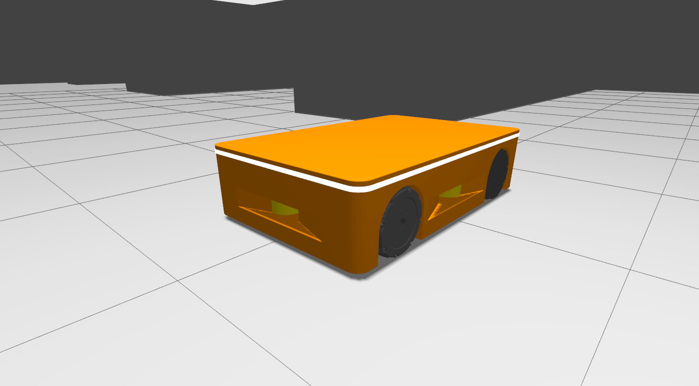

# MONA: Modular Open Navigating AMR

> An Autonomous Mobile Robot (AMR) project designed for warehouse logistics. Built on ROS 2 Humble, utilizing a strictly containerized swarm architecture to guarantee reproducibility and scalability.

[](https://github.com/vladubase/mona_robot/actions/workflows/ci.yml)
[](https://codecov.io/github/vladubase/mona_robot)
[](https://github.com/vladubase/mona_robot/actions/workflows/github-code-scanning/codeql)
[](https://www.codefactor.io/repository/github/vladubase/mona_robot)
[](https://api.securityscorecards.dev/projects/github.com/vladubase/mona_robot)
[](https://www.bestpractices.dev/projects/11949)



## About the Project
**MONA** (Modular Open Navigating AMR) is a scalable robot fleet management architecture. The primary focus is on safety-critical operations, hardware redundancy, and fault tolerance (FDIR concept) in compliance with industrial standards.

Within its microservice architecture, MONA functions as an Edge Agent in the distributed [**LISA (Logistics Intelligence & Swarm API)**](https://github.com/vladubase/lisa_api) ecosystem. LISA acts as the central fleet orchestrator, while MONA provides hardware abstraction, local navigation, and sensory data processing.

## MONA Robot Demonstration (YouTube)
[](https://www.youtube.com/watch?v=lFO3V1oQM2w)

## Key Architectural Features
* **Industrial Safety (ISO 13849-1 / IEC 61508):** Hybrid FDIR (Fault Detection, Isolation, and Recovery) architecture. Includes hardware redundancy for contactor cutoff circuits, Watchdog timers, and EMA (Exponential Moving Average) smoothing for heavy chassis peak loads during teleoperation.
* **Network Stack and DDS:** Direct host network access (`network_mode: host`) with flexible visibility control (`ROS_LOCALHOST_ONLY`) and strict DDS implementation enforcement (`rmw_fastrtps_cpp`).
* **Fleet Management Ready:** The architecture lays the foundation for future integration with VDA 5050 and Open-RMF fleet management standards (LISA).
* **Strict CI/CD:** Comprehensive code coverage utilizing static analyzers (Clang-Tidy, CPPCheck, Uncrustify, Black, Flake8) and unit testing (GTest).

## Component Architecture
The project is built upon the ROS 2 component architecture (Zero-copy IPC), divided into the following logical domains:
* **`mona_core/`** — Main orchestrator package (Bringup). Contains unified `.launch.py` files, global parameters (`.yaml`), maps, and FDIR Lifecycle Manager.
* **`mona_description/`** — Visual and physical robot representation (URDF, Xacro, 3D meshes).
* **`mona_safety/`** — Hardware sentinel (`SafetyNode`). Handles Emergency Stops (E-Stop), controls hardware contactors, limits velocities during system degradation, and escalates faults upon unauthorized movement via odometry validation.
* **`mona_control/`** — Dispatch module (Twist Mux). Responsible for routing commands from the gamepad and Nav2, EMA smoothing, velocity interpolation at 100 Hz, and preempting autonomous tasks during manual overrides.
* **`mona_perception/`** — Perception module. Contains the `LidarMergerNode` for fusing data from multiple laser scanners into a single, unified point cloud.

## Quick Start
The project utilizes strict environment isolation and a microservice architecture via Docker Compose.

### Environment Setup
```bash
# Clone the repository
git clone git@github.com:vladubase/mona_robot.git ~/MONA_ws
cd ~/MONA_ws

# Build the base image
make rebuild
```

The system supports multiple operational modes depending on your objective, utilizing our dedicated bash scripts:
#### Mode 1: Full Visualization (Single Robot & Physics Debugging)
Used for verifying collisions in Gazebo, wheel physics, and sensor outputs with full GUI support and gamepad teleoperation.
```bash
./scripts/start_1_robot.bash
```

#### Mode 2: Swarm Load Testing (Headless Infrastructure)
Used for testing the DDS network, fleet planners, and telemetry via Foxglove Studio. Physics are simulated without the graphical overhead.
```bash
# 1. Start the simulation infrastructure in the background (World & Clock Bridge)
./scripts/start_world.bash

# 2. Deploy a swarm of robots (e.g., 5 agents) in a separate terminal.
# Each will receive a unique namespace (mona_001 ... mona_005)
./scripts/start_fleet.bash 5

# 3. Monitor the fleet through Foxglove Studio.
```

#### Development Environment & Teardown
For manual package compilation (`colcon build`), ROS CLI utilities, and linters, a dedicated development container is provided:
```bash
# Enter the isolated development environment
docker compose up -d dev
docker compose exec dev bash

# Gracefully stop all robots, the simulation, and clean up networks
make down
```

## Launch Arguments
The primary robot launch file (`robot.launch.py`) supports flexible configuration via ROS 2 command-line arguments. In the Docker infrastructure, these parameters are handled automatically by the launch scripts.

| Argument       | Default Value | Description & System Impact                                                                                                                                                          |
| :------------- | :------------ | :----------------------------------------------------------------------------------------------------------------------------------------------------------------------------------- |
| `namespace`    | `mona_001`    | **Agent Isolation.** Defines the prefix for all topics, nodes, and parameters (e.g., `/mona_001/odom`). Critically important for Swarm deployment.                                   |
| `headless`     | `true`        | **Console Mode.** When `true`, disables RViz2 and Gazebo GUI to conserve CPU/GPU resources. Used for server deployments and massive multi-agent simulations.                         |
| `use_sim_time` | `true`        | **Time Synchronization.** When `true`, nodes utilize the simulation clock (`/clock` topic). Must be `true` for Gazebo simulation and `false` for real hardware.                      |
| `use_gamepad`  | `false`       | **Teleoperation.** When `true`, activates `joy_node` and `teleop_twist_joy` to process gamepad commands (DualSense/Xbox). This input has the highest multiplexer priority over Nav2. |
### Example: Manual Parameter Override
If you need to bypass the bash scripts and launch a robot manually with specific arguments (e.g., enabling the GUI and gamepad support):
```bash
docker compose run --rm mona-robot ros2 launch mona_core robot.launch.py headless:=false use_gamepad:=true use_sim_time:=true
```

## Documentation Index
All technical documentation is located in the `docs/` directory.

| Category            | Document                                                              | Description                                                                                                                                                   |
| ------------------- | --------------------------------------------------------------------- | ------------------------------------------------------------------------------------------------------------------------------------------------------------- |
| **Getting Started** | **[01_SETUP](docs/01_SETUP.md)**                                      | Instructions for Docker container deployment, hardware passthrough, and base simulation parameters.                                                           |
|                     | **[02_WORKFLOW](docs/02_WORKFLOW.md)**                                | Describes the Git-flow branching strategy and local package build steps.                                                                                      |
|                     | **[CONTRIBUTING](CONTRIBUTING.md)**                                   | Guidelines for contributing, naming conventions, and commit formatting standards.                                                                             |
| **Architecture**    | **[networking_and_fleet](docs/architecture/networking_and_fleet.md)** | Docker host mode network configuration, DDS settings, and VDA 5050 architecture preparation.                                                                  |
|                     | **[mapping_and_odometry](docs/architecture/mapping_and_odometry.md)** | Sensor fusion diagram (EKF), TF tree description, and base navigation stack nodes.                                                                            |
|                     | **[nodes_and_topics](docs/architecture/nodes_and_topics.md)**         | Documentation on node interfaces and topics, specifically detailing Lifecycle and FDIR routing.                                                               |
|                     | **[safety_and_fdir](docs/architecture/safety_and_fdir.md)**           | Overview of the Fault Detection, Isolation, and Recovery system and hardware redundancy principles.                                                           |
| **Guides**          | **[cpp_guide](docs/guides/cpp_guide.md)**                             | Automatic formatting rules (Uncrustify), linter settings, and ROS 2 Component development requirements.                                                       |
|                     | **[foxglove_guide](docs/guides/foxglove_guide.md)**                   | Instructions for configuring the Foxglove WebSocket bridge, importing custom dashboard layouts, and monitoring real-time fleet telemetry and FDIR health.     |
|                     | **[gamepad_setup](docs/guides/gamepad_setup.md)**                     | Principles for discovering and configuring input gamepads.                                                                                                    |
|                     | **[teleoperation_guide](docs/guides/teleoperation_guide.md)**         | Deadman Switch operation, DualSense axis mapping, and velocity command routing logic.                                                                         |
|                     | **[mapping_guide](docs/guides/mapping_guide.md)**                     | Instructions for using `slam_toolbox` and differences between static maps and dynamic local costmaps.                                                         |
|                     | **[testing_guide](docs/guides/testing_guide.md)**                     | Comprehensive guidelines for executing the local CI pipeline, writing C++ GTest suites for Lifecycle nodes, and adhering to strict static analysis standards. |
