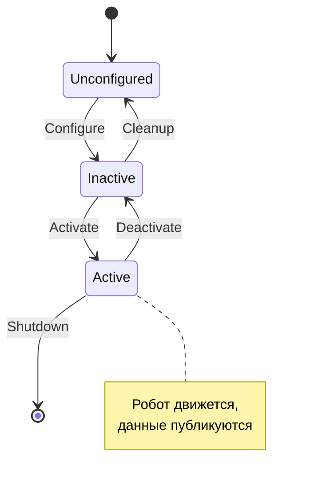

# Архитектура Lifecycle (Managed Nodes)

> **Determinism & Control**
> Робот не должен "просто начинать работать" при подаче питания. Запуск системы — это строго оркестрируемый процесс с проверкой успешности каждого шага.
## 1. Концепция
**Используем стандарт ROS 2 Lifecycle для управления состоянием узлов. Это позволяет:**
* Гарантировать что драйверы загрузились корректно до начала движения.
* Реализовать "Мягкую остановку" (Soft Stop) через деактивацию узлов без их убийства.
* Снизить нагрузку на CPU при простое.
## 2. Машина состояний
**Узел может находиться в одном из 4 основных состояний:**
1.  **Unconfigured (Не настроен)**
    * Состояние сразу после создания объекта.
    * *Задачи:* Нет. Ожидание команды `configure`.
2.  **Inactive (Пассивен)**
    * Память выделена, топики объявлены, соединение с "железом" установлено.
    * *Важно:* Узел **НЕ** публикует данные и **НЕ** управляет моторами.
3.  **Active (Активен)**
    * Штатный режим работы. Включаются таймеры и циклы обработки.
4.  **Finalized (Завершен)**
    * Подготовка к уничтожению объекта.

## 3. Оркестрация запуска
Запуск системы контролируется менеджером жизненного цикла (Lifecycle Manager) или последовательностью событий в Launch-файлах.
**Пример логики запуска:**
1. Загрузка `safety_node`.
2. Переход `safety_node` -> `Configured`.
3. Загрузка драйверов лидаров.
4. Переход драйверов -> `Configured` -> `Active`.
5. Только при успешном старте сенсоров: переход `safety_node` -> `Active`.
Это предотвращает ситуации, когда робот может получить команду движения, будучи "слепым".
