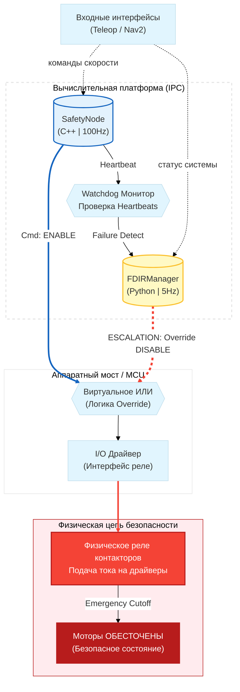

# Архитектура Безопасности и FDIR (Safety Pipeline)

> **Fault Detection, Isolation, and Recovery (FDIR)**
> 
> Автономный робот MONA использует гибридную двухуровневую систему безопасности. Система спроектирована так, чтобы выдерживать программные и аппаратные сбои (Graceful Degradation), не допуская причинения вреда окружающей среде или самому роботу.

> **Соответствие промышленным стандартам (Compliance & Standards)**
>
> Архитектура безопасности MONA разрабатывается с оглядкой на строгие промышленные стандарты функциональной безопасности. Хотя программная реализация в ROS 2 (на не-RTOS ядре) не может быть сертифицирована самостоятельно без аппаратного дублирования, мы применяем паттерны из следующих стандартов:
> 
> * **IEC 61508 (Functional Safety):** Использование раздельных состояний деградации (`DEGRADED`), механизма эскалации ошибок (FDIR) и независимого узла `SafetyNode` как программного логического решателя (Logic Solver).
> * **ISO 13849-1 (Safety of machinery):** Реализация принципа Deadman Switch (кнопка L2 на пульте управления), мониторинг таймаутов связи (Watchdog на 100 Гц) и безусловное размыкание аппаратных контакторов при потере контроля над скоростью.
> * **ISO 26262 (Road vehicles - Functional Safety):** Концепция непрерывного мониторинга состояния (Health State) и безопасного перевода системы в Safe State (PROTECTIVE_STOP / EMERGENCY) при обнаружении аномалий.

---
## 1. Гибридная архитектура безопасности
Архитектура разделена на два независимых контура, что обеспечивает соответствие стандарту **ISO 13849-1** (Аппаратное резервирование):
1. **FDIR Manager (Python / High-Level)**: Выполняет роль *Lifecycle-менеджера*. Медленный контур (5 Гц), который опрашивает узлы, читает конфигурацию `fdir_policy.yaml` и аппаратно перезагружает зависшие датчики.
2. **Safety Node (C++ / Low-Level)**: Работает на высоких частотах (100 Гц). Отвечает за контроль над скоростью, перехват аппаратного E-Stop, интерполяцию команд (Watchdog) и немедленное размыкание контакторов.
3. **Аппаратная защита механики (EMA-Filter)**
   Внутри `Safety Node` реализован асимптотический фильтр экспоненциального скользящего среднего (EMA-фильтр). Он применяется исключительно к ручному управлению (Teleop) и решает две критические задачи:
   * **Сглаживание пиковых нагрузок:** Тяжелое шасси (200 кг) обладает огромной инерцией. Резкое отклонение стика геймпада (от 0 до 100% за 0.1 сек) без фильтра привело бы к колоссальным ударным нагрузкам на редукторы, срыву сцепления колёс (пробуксовке) и скачку тока, способному выбить предохранители. 
   * **Плавная деградация (Soft Stop):** При срабатывании таймаута связи с пультом (отпускание Deadman Switch), фильтр `teleop_smoothing_factor` плавно, но быстро (за доли секунды) гасит скорость робота до нуля, предотвращая опрокидывание груза, после чего система переходит в режим удержания (IDLE). *(Примечание: В автономном режиме (AUTONOMOUS) фильтр отключается прозрачным роутингом, чтобы не вносить фазовую задержку в работу точных локальных планировщиков Nav2).*

### Диаграмма резервирования (Hardware Redundancy)
Оба узла имеют прямой доступ к аппаратному реле контакторов. Если ядро `safety_node` падает (Segfault), `fdir_manager` перехватывает управление и спамит сигнал отсечки по аппаратной шине.

## 2. Уровни критичности узлов (Tiers)
Поведение робота при сбое зависит от того, какой компонент вышел из строя. Это описывается в файле `fdir_policy.yaml`:
- **FATAL (Критический)**: Контроллеры моторов, главный узел безопасности. При их падении робот неуправляем.
    - _Реакция_: Немедленный **EMERGENCY STOP**. Отсечка питания контакторов.
- **PRIMARY (Основной)**: Главный лидар, одометрия.
    - _Реакция_: Переход в **PROTECTIVE STOP**. Робот останавливается программно (моторы удерживают позицию). Датчик отправляется на аппаратную перезагрузку по питанию.
- **AUXILIARY (Вспомогательный)**: Задние/боковые лидары, IMU.
    - _Реакция_: Переход в **DEGRADED MODE**. Робот продолжает движение, но с урезанными лимитами скорости. В фоне идет процесс восстановления датчика.

## 3. Машина состояний FDIR (Процесс восстановления)
При падении датчика запускается автоматический процесс лечения `ModuleRecoveryState`, включающий полное снятие питания с компонента.

## 4. Категории остановок (Stop Categories)
Различаем два типа остановки:
1. **Мягкая остановка (Protective Stop)**
    - Возникает при временной потере сети джойстика (Watchdog > 0.5s) или падении Primary датчиков.
    - Контакторы **ОСТАЮТСЯ ВКЛЮЧЕННЫМИ**.
    - Моторы работают в режиме удержания (Active Braking), предотвращая скатывание робота.
2. Аварийный режим (Emergency Stop)**
    - Возникает при программном сбое (Segfault FATAL узла), движении во время Protective Stop (Hardware Feedback) или нажатии красной кнопки.
    - Контакторы **РАЗМЫКАЮТСЯ**.
    - Питание на драйверах пропадает, механические тормоза защёлкиваются.

