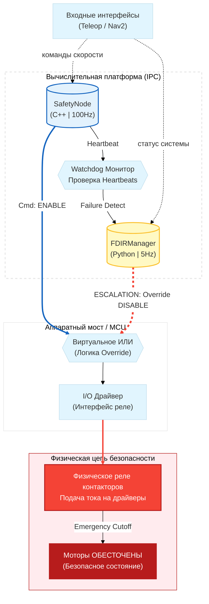

# Архитектура Безопасности и FDIR (Safety Pipeline)

> **Fault Detection, Isolation, and Recovery (FDIR)**
> 
> Автономный робот MONA использует гибридную двухуровневую систему безопасности. Система спроектирована так, чтобы выдерживать программные и аппаратные сбои (Graceful Degradation), не допуская причинения вреда окружающей среде или самому роботу.

> **Соответствие промышленным стандартам (Compliance & Standards)**
>
> Архитектура безопасности MONA разрабатывается с оглядкой на строгие промышленные стандарты функциональной безопасности. Хотя программная реализация в ROS 2 (на не-RTOS ядре) не может быть сертифицирована самостоятельно без аппаратного дублирования, мы применяем паттерны из следующих стандартов:
> * **IEC 61508 (Functional Safety):** Использование раздельных состояний деградации (`DEGRADED`), механизма эскалации ошибок (FDIR) и независимого узла `SafetyNode` как программного логического решателя (Logic Solver).
> * **ISO 13849-1 (Safety of machinery):** Реализация принципа Deadman Switch (кнопка L2 на пульте управления), мониторинг таймаутов связи (Watchdog на 100 Гц) и безусловное размыкание аппаратных контакторов при потере контроля над скоростью.
> * **ISO 26262 (Road vehicles - Functional Safety):** Концепция непрерывного мониторинга состояния (Health State) и безопасного перевода системы в Safe State (PROTECTIVE_STOP / EMERGENCY) при обнаружении аномалий.

---
## 1. Гибридная архитектура безопасности
Архитектура разделена на три независимых эшелона, что обеспечивает изоляцию математики управления от критической логики блокировок:
1. **Эшелон логики управления (`mona_control::TwistMuxNode`)**: Работает на 100 Гц. Отвечает исключительно за маршрутизацию и приоритеты (`/cmd_teleop` vs `/cmd_nav`). Включает в себя асимптотический фильтр экспоненциального скользящего среднего (EMA-фильтр) для сглаживания пиковых нагрузок тяжёлого шасси при ручном управлении. При перехвате джойстиком этот эшелон отправляет `CancelGoal` в сервер Nav2.
2. **Аппаратный Эшелон безопасности (`mona_safety::SafetyNode`)**: Главный диктатор системы (100 Гц). Не занимается фильтрацией, но имеет прямой доступ к аппаратному реле контакторов. Защищен от "зомби-коллбэков" через атомарные флаги. Если робот находится в `PROTECTIVE_STOP`, но физически смещается (по данным `/odom`), этот узел мгновенно эскалирует статус до аппаратного `EMERGENCY` и рубит питание.
3. **FDIR Manager (`mona_core`, Python)**: Медленный контур (5 Гц), выполняющий роль Lifecycle-менеджера. Опрашивает C++ компоненты (TwistMux, Safety, LidarMerger) через сервисы `GetState`. Если компоненты зависают, инициирует до 5 попыток мягкого перезапуска (`ACTIVATE`), после чего аппаратно перезагружает зависшие подсистемы по политике `fdir_policy.yaml`.

### Диаграмма резервирования (Hardware Redundancy)
Оба узла имеют прямой доступ к аппаратному реле контакторов. Если ядро `safety_node` падает (Segfault), `fdir_manager` перехватывает управление и спамит сигнал отсечки по аппаратной шине.

## 2. Уровни критичности узлов (Tiers)
Поведение робота при сбое зависит от того, какой компонент вышел из строя. Это описывается в файле `fdir_policy.yaml`:
- **FATAL (Критический)**: Контроллеры моторов, главный узел безопасности. При их падении робот неуправляем.
    - _Реакция_: Немедленный **EMERGENCY STOP**. Отсечка питания контакторов.
- **PRIMARY (Основной)**: Главный лидар, одометрия.
    - _Реакция_: Переход в **PROTECTIVE STOP**. Робот останавливается программно (моторы удерживают позицию). Датчик отправляется на аппаратную перезагрузку по питанию.
- **AUXILIARY (Вспомогательный)**: Задние/боковые лидары, IMU.
    - _Реакция_: Переход в **DEGRADED MODE**. Робот продолжает движение, но с урезанными лимитами скорости. В фоне идет процесс восстановления датчика.

## 3. Машина состояний FDIR (Процесс восстановления)
При падении датчика запускается автоматический процесс лечения `ModuleRecoveryState`, включающий полное снятие питания с компонента.

## 4. Категории остановок (Stop Categories)
Различаем два типа остановки:
1. **Мягкая остановка (Protective Stop)**
    - Возникает при временной потере сети джойстика (Watchdog > 0.5s) или падении Primary датчиков.
    - Контакторы **ОСТАЮТСЯ ВКЛЮЧЕННЫМИ**.
    - Моторы работают в режиме удержания (Active Braking), предотвращая скатывание робота.
2. Аварийный режим (Emergency Stop)**
    - Возникает при программном сбое (Segfault FATAL узла), движении во время Protective Stop (Hardware Feedback) или нажатии красной кнопки.
    - Контакторы **РАЗМЫКАЮТСЯ**.
    - Питание на драйверах пропадает, механические тормоза защёлкиваются.

## 5. Архитектура переменных состояния (Functional Safety Domains)

Для соответствия стандартам промышленной безопасности (ISO 13849 / SIL) система управления разделена на изолированные домены (Паттерн: *Вход -> Обработка -> Выход -> Инфраструктура*). Каждая переменная состояния жёстко привязана к своему домену, что исключает возможность гонки состояний (Race Condition) и логических коллизий в многопоточной среде.

Для обеспечения потокобезопасности в `component_container_mt` все указанные флаги реализованы через `std::atomic<bool>`.
* **`hardware_button_pressed_` (Сенсор / Домен Входа)**
  * **Назначение:** Отражает физическое состояние аппаратной кнопки экстренной остановки (E-STOP).
  * **Обоснование:** Используется для аппаратной блокировки программного сброса аварии. Согласно стандартам безопасности, удалённый сброс ошибки через систему управления флотом (FMS) категорически запрещён до тех пор, пока оператор физически не деактивирует кнопку на корпусе робота.
* **`e_stop_active_` (Программная защелка / Домен Обработки)**
  * **Назначение:** Логическая память состояния критической аварии (Level 2 E-STOP).
  * **Обоснование:** Действует как триггер-защелка (Latch). Может быть взведена внешним сервисом даже при отжатой физической кнопке. При значении `true` узел безусловно блокирует обработку любых штатных сообщений (включая `NORMAL`, `DEGRADED`) от подсистемы FDIR. Робот остаётся в заблокированном состоянии до явного вызова сервиса `/reset_e_stop`.
* **`contactors_enabled_` (Актуатор / Домен Выхода)**
  * **Назначение:** Фактическое состояние силовых реле питания контроллеров двигателей.
  * **Обоснование:** Изолировано от переменной `e_stop_active_`, так как обесточивание двигателей не всегда является следствием аварии. В состояниях длительного простоя (`IDLE`) или программного Protective Stop контакторы отключаются для энергосбережения и предотвращения аппаратного износа, при этом система не находится в состоянии критического E-STOP.
* **`is_processing_allowed_` (Инфраструктура ROS 2 / Домен Жизненного цикла)**
  * **Назначение:** Атомарный флаг, разрешающий выполнение асинхронных коллбэков.
  * **Обоснование:** Связан с архитектурой `rclcpp_lifecycle`. Поскольку топики ROS 2 обрабатываются асинхронно пулом потоков, существует риск поступления сообщения в момент транзитного перехода узла в состояние `Inactive`. Переменная гарантирует подавление "зомби-коллбэков", предотвращая случайную отправку команд на исполнительные механизмы деактивированным узлом.