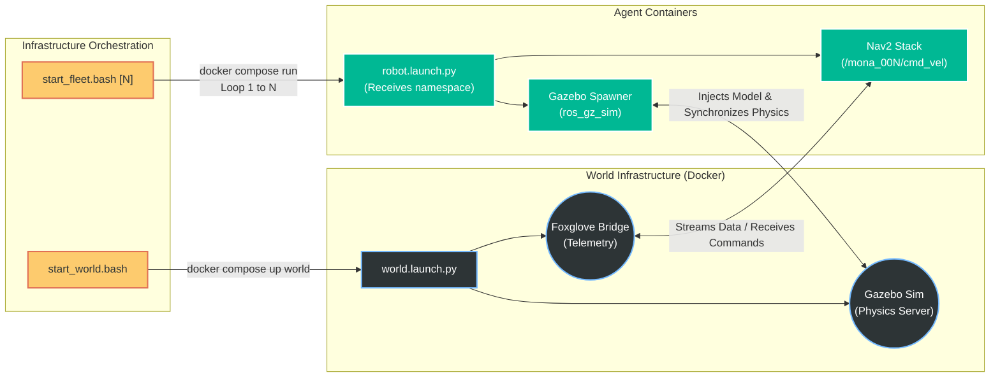

# Networking and Swarm Orchestration

> **Scalable Multi-Agent Communication**
> 
> This document details the configuration of the MONA robotic network stack within a containerized environment, the selection of the DDS implementation, and the integration strategy for high-level Fleet Management Systems (FMS).

## 1. Container Isolation and Network Stack

To minimize latency and ensure transparent node discovery (DDS Discovery), the development and runtime containers are configured to utilize the host's network stack:
* **`network_mode: host`**: The container bypasses the isolated Docker bridge, directly sharing the network interfaces (e.g., `eth0`, `wlan0`) with the host machine. This is strictly required for the correct routing of FastRTPS multicast traffic.
* **`ipc: host` / `pid: host`**: Required to enable Shared Memory (SHM) communication between nodes across different containers. This radically accelerates the transfer of massive data payloads (e.g., PointClouds, uncompressed Images) via Zero-copy IPC.

---

## 2. DDS Scope and Domain Management

The project leverages environment variables to dynamically manage the robot's network visibility without requiring container rebuilds:
* **`RMW_IMPLEMENTATION=rmw_fastrtps_cpp`**: Hardcodes the DDS implementation to eProsima Fast DDS. This guarantees determinism, high throughput, and strict compliance with industrial DDS standards.
* **`ROS_DOMAIN_ID=50`**: Isolates the MONA swarm telemetry from other default ROS 2 networks (which typically default to ID 0/42) operating on the same physical subnet, preventing multicast cross-talk.
* **`ROS_LOCALHOST_ONLY`**:
    * `1` *(Development Mode)*: Confines all DDS traffic to the loopback interface. This shields the local Wi-Fi network from being saturated by heavy simulation topics (TF, PointClouds) during local testing.
    * `0` *(Integration Mode)*: Enables multicast. The robot can exchange data with external RViz servers, hardware teleoperation consoles, or other agents in the local subnet.

---

### 3. Fleet Management Integration (Roadmap)

In accordance with industrial logistics standards, MONA is engineered for seamless integration with top-level fleet orchestrators:

### LISA (Logistics Intelligence & Swarm API)
The primary fleet orchestrator for the MONA ecosystem.
* **Architecture:** Acts as the central master server. The robot runs an MQTT-ROS 2 bridge that translates high-level JSON directives into local ROS 2 topics (e.g., `/mona_001/goal_pose`, `/mona_001/cmd_nav`, `/mona_001/robot_status`).

### VDA 5050
The German Association of the Automotive Industry standard for AGV/AMR communication with a master controller.
* **Architecture:** The LISA API architecture inherently mirrors VDA 5050 structures. Future iterations will natively support strict VDA 5050 MQTT payload bindings (Order, InstantActions, State) for cross-vendor fleet compatibility.

### Open-RMF (Robotics Middleware Framework)
An open-source fleet management system by Open Robotics for heterogeneous fleets.
* **Architecture:** A dedicated `rmf_fleet_adapter` will be deployed on the robot's edge compute to negotiate routes and manage traffic conflicts at warehouse intersections.

---

## 4. Swarm Spawning Architecture

The deployment relies on orchestrated bash scripts that handle dynamic namespacing and synchronized initialization, replacing standard Docker Compose scaling limits.

