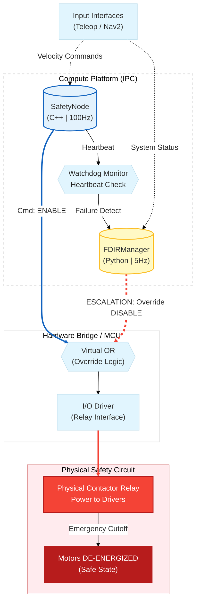

# Safety Architecture and FDIR Pipeline

> **Fault Detection, Isolation, and Recovery (FDIR)**
> 
> The autonomous mobile robot MONA utilizes a hybrid, dual-layer safety system. It is engineered to withstand both software and hardware faults (Graceful Degradation), strictly preventing harm to the environment, personnel, or the robot itself.

## Regulatory Compliance and Industrial Standards

The MONA safety architecture is designed with strict adherence to industrial functional safety standards. While a standard ROS 2 implementation on a non-RTOS Linux kernel cannot be certified independently without hardware redundancy, we implement core patterns derived from the following directives:
* **IEC 61508 (Functional Safety):** Utilization of distinct degradation states (`DEGRADED`), an error escalation mechanism (FDIR), and an independent `SafetyNode` acting as the software Logic Solver.
* **ISO 13849-1 (Safety of Machinery):** Implementation of the Deadman Switch principle (L2 button on the teleoperation controller), 100Hz communication watchdog monitoring, and unconditional hardware contactor de-energization upon loss of velocity control.
* **ISO 26262 (Road Vehicles - Functional Safety):** Application of continuous Health State monitoring and the deterministic transition of the system into a Safe State (`PROTECTIVE_STOP` / `EMERGENCY`) upon anomaly detection.

---

## 1. Hybrid Safety Architecture

1. **Control Logic Echelon (`mona_control::TwistMuxNode`):** Operates at 100 Hz. Strictly responsible for routing and priority arbitration (`/cmd_teleop` vs `/cmd_nav`). It includes an asymptotic Exponential Moving Average (EMA) filter to smooth the peak kinetic loads of the heavy chassis during manual teleoperation. Upon gamepad override, this echelon explicitly dispatches a `CancelGoal` request to the Nav2 server.
2. **Hardware Safety Echelon (`mona_safety::SafetyNode`):** The supreme logical arbiter of the system (100 Hz). It performs no velocity filtering but maintains exclusive, direct access to the hardware contactor relays. It is protected against asynchronous "zombie-callbacks" via atomic state flags. If the agent is in a `PROTECTIVE_STOP` state but physical displacement is detected (via odometry feedback), this node instantly escalates the status to a hardware `EMERGENCY` and physically severs motor power.
3. **FDIR Manager (`mona_core`, Python):** An asynchronous monitoring loop (5 Hz) acting as the Lifecycle Manager within each agent's isolated namespace (e.g., `/mona_001`). It polls local C++ components (TwistMux, Safety, LidarMerger) via `GetState` services. Upon detecting a freeze, it initiates up to 5 soft recovery attempts (a `Deactivate -> Activate` cycle), after which it triggers a hard power-cycle of the failed subsystem according to the `fdir_policy.yaml` policy.

### Hardware Redundancy Diagram

Both controlling nodes possess independent access paths to the hardware contactor relays. If the `safety_node` process suffers a critical software failure (e.g., a `Segfault`), the `fdir_manager` seizes hardware control, continuously broadcasting a cutoff signal via the redundant bus.

---

## 2. Node Criticality Levels (Tiers)

The robot's fallback behavior upon component failure depends strictly on the predefined tier of the failing node, as configured in `fdir_policy.yaml`:
- **FATAL**: Motor controllers, core `safety_node`. The robot is physically uncontrollable without these.
    - _Response_: Immediate **EMERGENCY STOP**. Complete hardware contactor power cutoff.
- **PRIMARY**: Main LiDAR, Odometry source.
    - _Response_: Transition to **PROTECTIVE STOP**. The robot halts via software (motors actively hold position). The failed sensor is sent a hardware power-cycle command.
- **AUXILIARY**: Rear/Side LiDARs, IMU.
    - _Response_: Transition to **DEGRADED MODE**. The robot continues navigating but enforces heavily restricted velocity limits. Background recovery processes attempt to reboot the sensor.

---

## 3. FDIR State Machine (Recovery Process)

When a sensor fails, the `ModuleRecoveryState` automated recovery sequence is initiated. This encompasses an orchestrated progression of ROS 2 lifecycle transitions and, if necessary, a complete hardware power cutoff to drain the component's capacitors before rebooting.

---

## 4. Stop Categories

The architecture distinguishes between two fundamental halt types:
1. **Soft Stop (Protective Stop)**
    - Triggered by temporary teleoperation network loss (Watchdog > 0.5s) or the failure of a PRIMARY sensor.
    - Contactors **REMAIN ENERGIZED**.
    - Motors operate in Active Braking mode (holding position torque) to prevent the chassis from rolling down inclines.
2. **Hard Stop (Emergency Stop)**
    - Triggered by software faults (FATAL node Segfault), physical displacement during a Protective Stop (Hardware Feedback mismatch), or a manual physical E-STOP button press.
    - Contactors are **OPENED (DE-ENERGIZED)**.
    - Power to the motor bridge drivers is severed, and physical mechanical brakes are engaged.

---

## 5. State Variables Architecture (Functional Safety Domains)

To comply with industrial safety standards (ISO 13849 / SIL), the control software is partitioned into isolated operational domains (Pattern: _Input -> Processing -> Output -> Infrastructure_). Every state variable is strictly bound to its respective domain, eliminating Race Conditions and logical collisions in the multi-threaded `component_container_mt` environment.

All flags below are implemented as `std::atomic<bool>` to guarantee thread safety.
- **`hardware_button_pressed_` (Sensor / Input Domain)**
    - **Purpose:** Reflects the physical electrical state of the chassis E-STOP button.
    - **Rationale:** Serves as a hardware interlock against software resets. According to safety directives, remotely clearing a fault via the global fleet orchestrator ([LISA API](https://github.com/vladubase/lisa_api)) is strictly prohibited until a human operator physically releases the mushroom button on the agent.
- **`e_stop_active_` (Software Latch / Processing Domain)**
    - **Purpose:** The logical memory of a Level 2 EMERGENCY.
    - **Rationale:** Acts as a persistent latch. It can be triggered by external services even if the physical button is not pressed. When `true`, the node unconditionally drops all routine state updates (e.g., `NORMAL`, `DEGRADED`) from the FDIR subsystem. The robot remains paralyzed until an explicit call to the `/reset_e_stop` service is made.
- **`contactors_enabled_` (Actuator / Output Domain)**
    - **Purpose:** The actual commanded state of the high-voltage motor relays.
    - **Rationale:** Decoupled from `e_stop_active_` because de-energizing the motors is not exclusively an emergency reaction. During prolonged `IDLE` states or specific Protective Stops, contactors are deliberately opened to conserve power and prevent hardware degradation, without throwing the system into a critical E-STOP state.
- **`is_processing_allowed_` (ROS 2 Infrastructure / Lifecycle Domain)**
    - **Purpose:** An atomic gatekeeper permitting the execution of asynchronous callbacks.
    - **Rationale:** Intrinsically tied to the `rclcpp_lifecycle` architecture. Because ROS 2 topics are handled asynchronously by a thread pool, a message might arrive exactly as the node transitions to `Inactive`. This variable guarantees the suppression of "zombie-callbacks", strictly preventing a deactivated node from inadvertently dispatching commands to the hardware actuators.